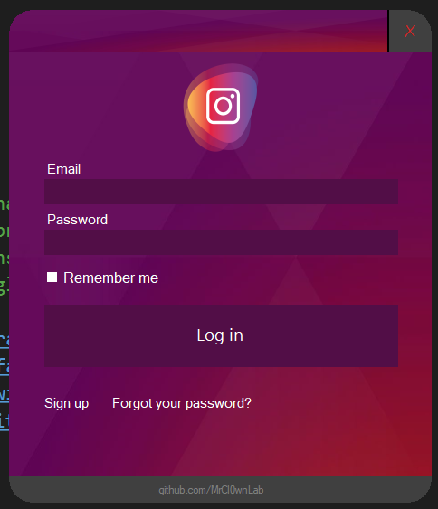
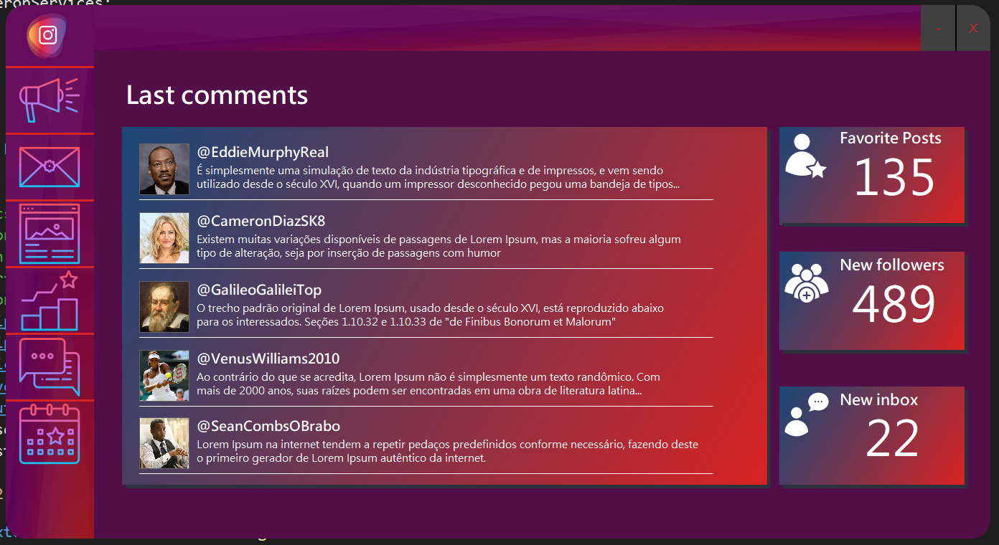

# UX_Login_Insta_Dash
> Ux studies with C#


[](https://docs.microsoft.com/pt-br/visualstudio/get-started/csharp/?view=vs-2019)
[](https://docs.microsoft.com/pt-br/visualstudio/get-started/csharp/?view=vs-2019)
[]()


```
 + Autor: MrCl0wn
 + Blog: http://blog.mrcl0wn.com
 + GitHub: https://github.com/MrCl0wnLab
 + Twitter: https://twitter.com/MrCl0wnLab
 + Email: mrcl0wnlab\@\gmail.com
```

## PRINT FORM


## PRINT FORM


## USED IMAGES 
[/Resources](/Resources)